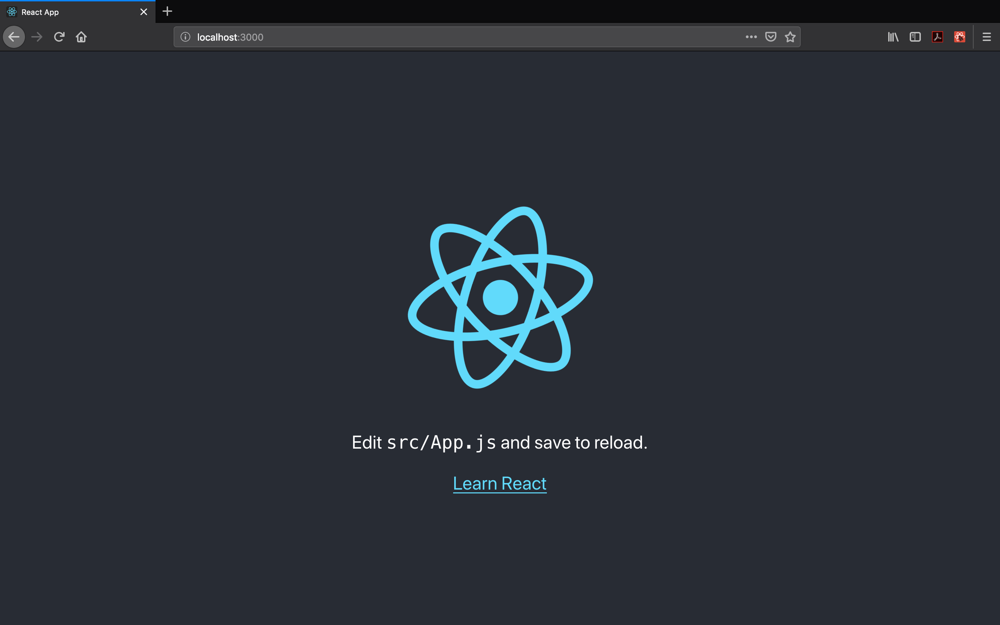
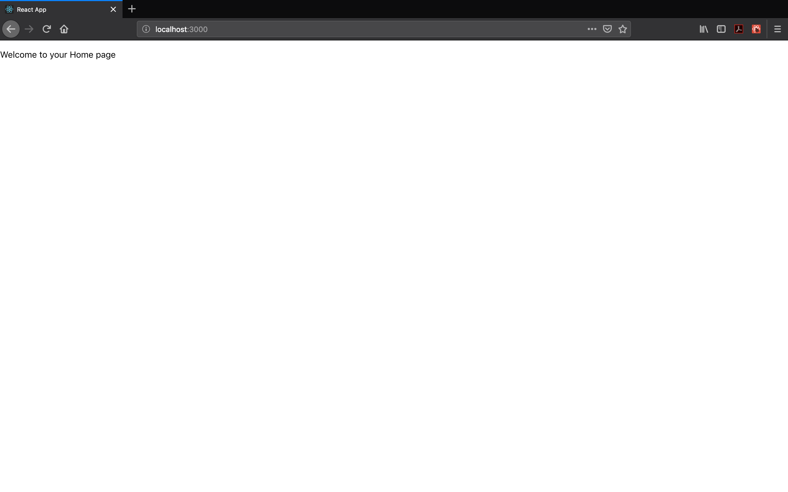
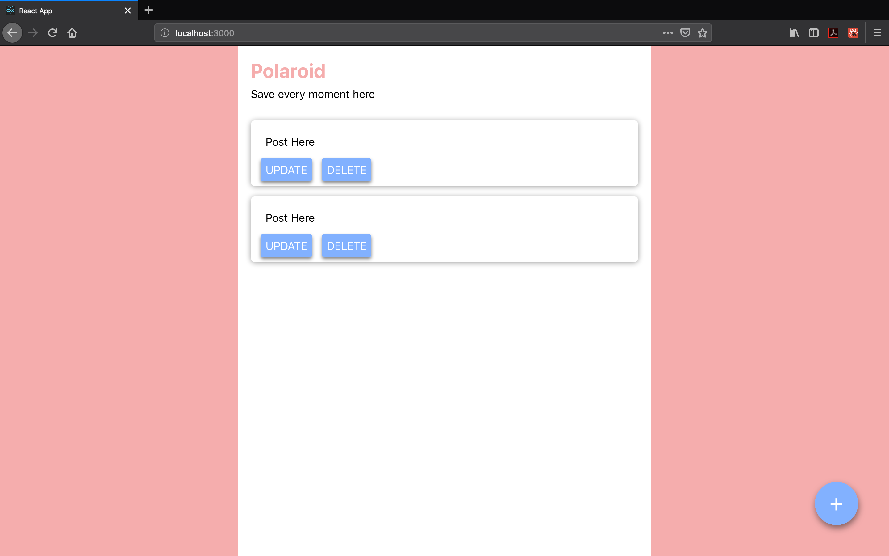
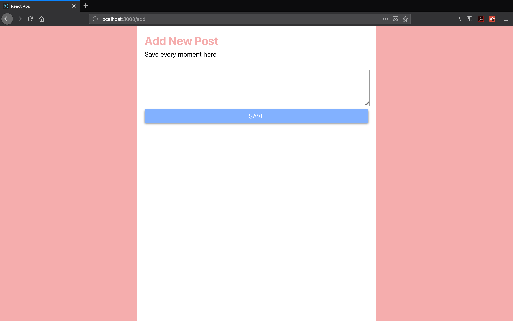

Pada tutorial kali ini kita akan membahas bagaimana cara membuat sebuah aplikasi web menggunakan `React Js`. Aplikasi yang kita buat akan memberikan fitur menampilkan, tambah, edit, dan hapus post.

Pertama tama mari kita buat terlebih dahulu projeknya. Ketikan sintaksis berikut di dalam terminal (CMD pada Windows) Anda.

```sh
npx create-react-app polaroid
```

Setelah itu, folder `polaroid` berisikan kode aplikasi kita akan terbentuk. Arahkan direktori pada terminal Anda ke dalam folder tersebut

```sh
cd polaroid
```

Setelah itu jalankan aplikasinya dengan mengetikkan sintaksis berikut:

```sh
yarn start
atau
npm start
```

Aplikasi akan berjalan di link berikut http://localhost:3000/ dan terlihat seperti ini:



---

## Basic

Di React terdapat 4 hal yang paling umum digunakan, yaitu `component`, `props`, `state` dan `lifecycle`.

#### Component

Component adalah cara di React yang memungkinkan kita dapat menggunakan kembali kode UI yang telah kita buat. Misalnya kita memiliki tombol yang sudah kita beri style dengan css. Agar kita tidak menulis banyak kode dengan style yang sama kita dapat membuatnya menjadi sebuah component sendiri. Cara menulis component sendiri ada dua cara:

Pertama adalah dengan menggunakan `function`:

```js
function Button(props) {
  return <button>{props.children}</button>;
}
```

Kedua adalah dengan menggunakan `class`:

```js
class Button extends React.Component {
  render() {
    return <button>{this.props.children}</button>;
  }
}
```

Lalu bagaimana cara menggunakan/memanggil component tersebut?

```js
import React from 'react';
import Button from './Button'; // highlight-line

function App(props) {
  return (
    <div>
      <Button>Click Me</Button> // highlight-line
    </div>
  );
}
```

atau apabila menggunakan `class` akan terlihat seperti berikut:

```js
import React from 'react';
import Button from './Button'; // highlight-line

class App extends React.Component {
  render() {
    return (
      <div>
        <Button>Click Me</Button> // highlight-line
      </div>
    );
  }
}
```

---

#### Props

Props adalah cara di React untuk memberikan sebuah value ke sebuah component dan bersifat **Read Only**. Misalnya kita ada sebuah tombol yang memiliki prop `title` seperti berikut:

```js
...
function Button(props) {
  return <button>{props.title}</button>; // highlight-line
}

class App extends React.Component {
  render() {
    return (
      <div>
        <Button title='Click Me' /> // highlight-line
      </div>
    );
  }
}
```

---

#### State

State adalah cara di React untuk menyimpan sebuah nilai yang nantinya dapat kita ubah. State ini bersifat dinamis dan React akan menampilkanya secara instan ketika state di update.

Kita dapat menggunakan state pada component berbentuk function maupun yang berbentuk class:

Pada class

```js
class Counter extends React.Component {
  // deklarasi state
  state = {
    count: 0
  };

  render() {
    return (
      <div>
        {/* cara memanggil state */}
        <p>{this.state.count}</p>
      </div>
    );
  }
}
```

Pada function

```js
function Counter(props) {
  // deklarasi state
  const [count, setCount] = React.useState(0);

  return (
    <div>
      {/* cara memanggil state */}
      <p>{this.state.count}</p>
    </div>
  );
}
```

Kemudian bagaimana cara memperbarui sebuah state?

Pada class component, kita dapat menggunakan `this.setState()` untuk memperbarui state dan bila menggunakan sebuah function component, kita dapat menggunakan setter yang telah buat misalnya seperti `setCount` pada contoh di atas

Pada class

```js
class Counter extends React.Component {
  // deklarasi state
  state = {
    count: 0
  };

  render() {
    return (
      <div>
        {/* cara memanggil state */}
        <p>{this.state.count}</p>
        <button
          onClick={() => {
            this.setState({ count: this.state.count + 1 });
          }}
        >
          Add Count
        </button>
      </div>
    );
  }
}
```

Pada function

```js
function Counter(props) {
  // deklarasi state
  const [count, setCount] = React.useState(0);

  return (
    <div>
      {/* cara memanggil state */}
      <p>{this.state.count}</p>
      <button
        onClick={() => {
          setCount(count + 1);
        }}
      >
        Add Count
      </button>
    </div>
  );
}
```

Kita tidak boleh memperbarui state secara langsung seperti ini:

```js
// pada class
this.state.count = this.state.count + 1;

// pada function
count = count + 1;
```

Kita harus menggunakan:

```js
// pada class
this.setState({ count: this.state.count + 1 });

// pada function
setCount(count + 1);
```

---

#### Lifecycle

Di React terdapat banyak lifecycle yang tersedia. Kalian bisa membaca lebih lanjut di [sini](https://reactjs.org/docs/react-component.html#mounting). Tapi yang paling umum digunakan adalah `render` dan `componentDidMount`

Seperti yang sudah kalian lihat di kode-kode sebelumnya, `render` digunakan pada sebuah class component untuk menuliskan bagian view sebuah component. `render` sendiri akan mengembalikan/return sintaksis yang terlihat seperti tag-tag HTML.

Kemudian ada `componentDidMount` di dalam sebuah class component. `componentDidMount` merupakan salah satu adalah sebuah method/function yang akan dijalankan ketika sebuah component sudah di tampilkan atau dengan kata lain di-render. Misalnya ketika kita butuh untuk mengambil data dari server, kita dapat menggunakan `componentDidMount` untuk melakukannya.

```js
// ...
class Counter extends React.Component {
  // deklarasi state
  state = {
    count: 0
  };

  // highlight-start
  async componentDidMount() {
    try {
      // mengambil data dari server
      const data = await getCountFromApi();
      // memperbarui state count dengan data
      this.setState({ count: data });
    } catch (error) {
      console.log(error);
    }
  }
  // highlight-end

  render() {
    return (
      <div>
        {/* cara memanggil state */}
        <p>{this.state.count}</p>
      </div>
    );
  }
}
// ...
```

Lalu bagaimana dengan function component?

Pada function component, kita dapat menggunakan API baru dari React yaitu `useEffect`. Lihat contoh berikut:

```js
function Counter(props) {
  const [count, setCount] = React.useState(0);

  // highlight-start
  React.useEffect(() => {
    getCount();
  }, []);

  async function getCount() {
    try {
      // mengambil data dari server
      const data = await getCountFromApi();
      // memperbarui state count dengan data
      setCount(data);
    } catch (error) {
      console.log(error);
    }
  }

  // highlight-end

  return (
    <div>
      {/* cara memanggil state */}
      <p>{this.state.count}</p>
    </div>
  );
}
```

---

### Start Coding

Di bagian ini, kita akan mulai membuat aplikasi yang telah dijelaskan sebelumnya dan ditulis dalam bentuk **class component**

Sebelum kita mulai mari tambahkan package `react-router-dom` terlebih dahulu:

```sh
yarn add react-router-dom
atau
npm install --save react-router-dom
```

Package di atas berfungsi untuk melakukan routing atau berpindah halaman pada aplikasi kita

#### Class Component

Pertama buat dulu folder `pages` di dalam folder `src`. Setelah itu buat file `Home.js` di dalamnya dan tuliskan kode berikut:

```js
// Home.js
import React from 'react';

class Home extends React.Component {
  render() {
    return (
      <div>
        <p>Welcome to your Home page</p>
      </div>
    );
  }
}

export default Home;
```

Setelah itu mari ubah kode pada `App.js` menjadi seperti berikut:

```js
import React from 'react';
import { BrowserRouter, Route, Switch } from 'react-router-dom';

// import pages di sini
import Home from './pages/Home.js';

class App extends React.Component {
  render() {
    return (
      <BrowserRouter>
        <Switch>
          <Route exact path='/' render={props => <Home {...props} />} />
        </Switch>
      </BrowserRouter>
    );
  }
}

export default App;
```

Tampilan pada browser akan tampak seperti berikut:



Karena kita menggunakan sebuah format layout yang sama untuk halaman lain nantinya, sekarang mari kita buat component `Layout.js` di dalam folder `components` (buat folder terlebih dahulu bila belum ada) dan tuliskan kode berikut.

```js
// Layout.js
import React from 'react';
import './Layout.css';

export class Layout extends React.Component {
  render() {
    return <div className='layout-container'>{this.props.children}</div>;
  }
}

export default Layout;
```

```css
/* Layout.css */
body {
  background-color: #f5adad;
}

.layout-container {
  flex: 1;
  display: flex;
  margin: 0 auto;
  max-width: 670px;
  min-width: 670px;
  flex-direction: column;
  min-height: 100vh;
}

.content-container {
  flex: 1;
  background: white;
  padding: 1.3125rem;
  position: relative;
}

.content-container .header {
  color: #f5adad;
  margin-bottom: 8px;
  margin-top: 0;
}

.content-container .sub-header {
  font-size: 18px;
  margin-top: 2px;
  margin-bottom: 32px;
}
```

Kemudian ubah `Home.js` menjadi seperti ini:

```js
...
class Home extends React.Component {
  render() {
    return (
      <Layout> // highlight-line
        <div className='content-container'> // highlight-line
          <h1 className="header">Polaroid</h1> // highlight-line
          <p className="sub-header">Save every moment here</p> // highlight-line
          <ul>
            <li>First post</li>
            <li>Second Post</li>
          </ul>
        </div>
      </Layout> // highlight-line
    );
  }
}
...
```

Pada aplikasi kita, kita akan menampilkan list of item dengan tombol update dan delete di dalamnya. Maka dari itu kita perlu untuk membuat component sendiri bernama `PostItem`.

```js
// PostItem.js
import React from 'react';
import './PostItem.css';

export class PostItem extends React.Component {
  render() {
    return (
      <div className='post-item-container'>
        <p className='caption'>Post Here</p>
        <button
          className='post-button'
          onClick={() => {
            console.log('update');
          }}
        >
          UPDATE
        </button>
        <button
          className='post-button'
          onClick={() => {
            console.log('delete');
          }}
        >
          DELETE
        </button>
      </div>
    );
  }
}

export default PostItem;
```

```css
/* PostItem.css */
.post-item-container {
  flex: 1;
  padding: 8px;
  border-radius: 8px;
  box-shadow: 0 1px 8px 0 rgba(20, 20, 20, 0.4);
}

.caption {
  margin: 16px;
  font-size: 18px;
  white-space: pre-line;
}

.post-button {
  background: #82b1ff;
  border: none;
  outline: none;
  border-radius: 4px;
  padding: 8px;
  font-size: 18px;
  color: white;
  box-shadow: 0 3px 5px 0 rgba(20, 20, 20, 0.5);
  margin: 8px 0;
  cursor: pointer;
  margin: 0 8px;
}
```

Setelah itu mari buat file css untuk `Home.js` kita.

```css
/* Home.css */
.post-list {
  padding: 0;
}

.post-list .post-item {
  display: flex;
  list-style-type: none;
  margin-bottom: 16px;
}

.floating-action-button {
  width: 70px;
  height: 70px;
  background-color: #82b1ff;
  border-radius: 50%;
  box-shadow: 1px 5px 10px 0 rgba(20, 20, 20, 0.5);
  transition: all 0.1s ease-in-out;
  border: none;

  font-size: 40px;
  color: white;
  text-align: center;
  line-height: 0px;

  position: fixed;
  right: 50px;
  bottom: 50px;

  padding-bottom: 6px;
  cursor: pointer;
}

.floating-action-button:hover {
  box-shadow: 1px 5px 14px 0 rgba(20, 20, 20, 0.5);
  transform: scale(1.05);
}
```

Setelah itu ubah file `Home.js` menjadi seperti:

```js
import React from 'react';
import Layout from '../components/Layout';
import './Home.css'; // highlight-line
import PostItem from '../components/PostItem'; // highlight-line

class Home extends React.Component {
  render() {
    return (
      <Layout>
        <div className='content-container'>
          <h1 className='header'>Polaroid</h1>
          <p className='sub-header'>Save every moment here</p>
          // highlight-start
          <ul className='post-list'>
            <li className='post-item'>
              <PostItem />
            </li>
            <li className='post-item'>
              <PostItem />
            </li>
          </ul>
          <button className='floating-action-button'>+</button>
          // highlight-end
        </div>
      </Layout>
    );
  }
}

export default Home;
```

Sejauh ini halaman Home kita akan tampak seperti berikut:



Setelah itu kita akan membuat page untuk menambahkan post baru. Mari buat file baru bernama `Add.js` dan `Add.css` di dalam folder pages.

```js
// Add.js
import React from 'react';
import './Add.css';
import Layout from '../components/Layout';

export class Add extends React.Component {
  state = {
    caption: ''
  };

  render() {
    return (
      <Layout>
        <div className='content-container'>
          <h1 className='header'>Add New Post</h1>
          <p className='sub-header'>Save every moment here</p>
          <div>
            <textarea
              className='caption-field'
              value={this.state.caption}
              onChange={e => {
                this.setState({ caption: e.target.value });
              }}
            />
            <button
              className='button'
              onClick={() => {
                console.log(this.state.caption);
              }}
            >
              SAVE
            </button>
          </div>
        </div>
      </Layout>
    );
  }
}

export default Add;
```

```css
/* Add.css */
.caption-field {
  width: 100%;
  min-height: 100px;
}

img {
  width: 100%;
}

.button {
  background: #82b1ff;
  border: none;
  outline: none;
  border-radius: 4px;
  width: 100%;
  padding: 8px;
  font-size: 18px;
  color: white;
  box-shadow: 0 3px 5px 0 rgba(20, 20, 20, 0.5);
  margin: 8px 0;
  cursor: pointer;
}

.button:active {
  box-shadow: 0 2px 3px 0 rgba(20, 20, 20, 0.5);
}

.button:disabled {
  color: #b5b5b5;
  background-color: #e5e5e5;
  box-shadow: none;
}
```

Setelah itu mari tambahkan halaman `Add` ke dalam route aplikasi kita

```js
import React from 'react';
import { BrowserRouter, Route, Switch } from 'react-router-dom';

// import pages di sini
import Home from './pages/Home.js';
import Add from './pages/Add.js'; // highlight-line

class App extends React.Component {
  render() {
    return (
      <BrowserRouter>
        <Switch>
          <Route exact path='/' render={props => <Home {...props} />} />
          <Route exact path='/add' render={props => <Add {...props} />} /> // highlight-line
        </Switch>
      </BrowserRouter>
    );
  }
}

export default App;
```

Mari kita tambahkan fungsi agar saat kita menekan tombol **+** pada halaman Home akan mengarahkan kita ke halaman Add.

```js
// Home.js
import React from 'react';
import './Home.css';
import Layout from '../components/Layout';
import PostItem from '../components/PostItem';

class Home extends React.Component {
  render() {
    return (
      <Layout>
        <div className='content-container'>
          <h1 className='header'>Polaroid</h1>
          <p className='sub-header'>Save every moment here</p>
          <ul className='post-list'>
            <li className='post-item'>
              <PostItem />
            </li>
            <li className='post-item'>
              <PostItem />
            </li>
          </ul>
          // highlight-start
          <button
            className='floating-action-button'
            onClick={() => {
              this.props.history.push('/add');
            }}
          >
            +
          </button>
          // highlight-end
        </div>
      </Layout>
    );
  }
}

export default Home;
```

Ketika kita menekan tombol **+** pada halaman Home akan mengalihkan kita ke halaman Add



Selain halaman Add, kita juga perlu halaman Update untuk aplikasi kita. Mari kita buat halaman Update dengan kode berikut:

```js
// Update.js
import React from 'react';
import './Add.css';
import Layout from '../components/Layout';

export class Update extends React.Component {
  state = {
    caption: ''
  };

  render() {
    return (
      <Layout>
        <div className='content-container'>
          <h1 className='header'>Update Post</h1>
          <p className='sub-header'>Save every moment here</p>
          <div>
            <textarea
              className='caption-field'
              value={this.state.caption}
              onChange={e => {
                this.setState({ caption: e.target.value });
              }}
            />
            <button
              className='button'
              onClick={() => {
                console.log(this.state.caption);
              }}
            >
              SAVE
            </button>
          </div>
        </div>
      </Layout>
    );
  }
}

export default Update;
```

Setelah itu tambahkan route ke halaman Update di file `App.js`

```js
import React from 'react';
import { BrowserRouter, Route, Switch } from 'react-router-dom';

// import pages di sini
import Home from './pages/Home.js';
import Add from './pages/Add.js';
import Update from './pages/Update.js'; // highlight-line

class App extends React.Component {
  render() {
    return (
      <BrowserRouter>
        <Switch>
          <Route exact path='/' render={props => <Home {...props} />} />
          <Route exact path='/add' render={props => <Add {...props} />} />
          // highlight-start
          <Route exact path='/update' render={props => <Update {...props} />} />
          // highlight-end
        </Switch>
      </BrowserRouter>
    );
  }
}

export default App;
```

Setelah itu mari tambahkan fungsi pindah halaman saat kita menekan tombol `update` pada `PostItem`

```js
// PostItem.js
import React from 'react';
import './PostItem.css';
import { withRouter } from 'react-router-dom'; // highlight-line

export class PostItem extends React.Component {
  render() {
    return (
      <div className='post-item-container'>
        <p className='caption'>Post Here</p>
        <button
          className='post-button'
          onClick={() => {
            this.props.history.push('/update'); // highlight-line
          }}
        >
          UPDATE
        </button>
        <button
          className='post-button'
          onClick={() => {
            console.log('delete');
          }}
        >
          DELETE
        </button>
      </div>
    );
  }
}

export default withRouter(PostItem); // highlight-line
```

Sekarang mari kita buat fungsional dari aplikasi kita. Karena di setiap halaman butuh untuk mengakses `state` yang sama yaitu kumpulan post, maka kita harus membuat state itu menjadi global. Untuk menyelesaikan masalah ini, kita akan menggunakan `Context API` yang sudah disediakan oleh React.

Pertama mari kita buat folder baru bernama `context` dan buat file `PostContext.js`

```js
// PostContext.js
import React from 'react';

const PostContext = React.createContext(null);

export default PostContext;
```

Kemudian mari kita import file tersebut ke dalam file `App.js` dan implementasikan seperti berikut:

```js
// App.js
import React from 'react';
import { BrowserRouter, Route, Switch } from 'react-router-dom';

// import pages di sini
import Home from './pages/Home.js';
import Add from './pages/Add.js';
import Update from './pages/Update.js';
import PostContext from './context/PostContext.js'; // highlight-line

class App extends React.Component {
  // highlight-start
  state = {
    posts: []
  };

  add = post => {
    let posts = [...this.state.posts];
    posts = [{ ...post, id: Math.random() }, ...posts];
    this.setState({ posts: posts });
  };

  update = post => {
    const posts = [...this.state.posts];
    let temp = posts.find(o => o.id === post.id);
    posts[posts.indexOf(temp)] = post;
    this.setState({ posts: posts });
  };

  delete = id => {
    let posts = [...this.state.posts];
    let post = posts.find(o => o.id === id);
    posts.splice(posts.indexOf(post), 1);
    this.setState({ posts: posts });
  };
  // highlight-end

  render() {
    return (
      // highlight-start
      <PostContext.Provider
        value={{
          posts: this.state.posts,
          add: this.add,
          update: this.update,
          delete: this.delete
        }}
      >
        // highlight-end
        <BrowserRouter>
          <Switch>
            <Route exact path='/' render={props => <Home {...props} />} />
            <Route exact path='/add' render={props => <Add {...props} />} />
            <Route
              exact
              path='/update'
              render={props => <Update {...props} />}
            />
          </Switch>
        </BrowserRouter>
      </PostContext.Provider> // highlight-line
    );
  }
}

export default App;
```

Kemudian ubah `Home.js` menjadi seperti ini:

```js
// Home.js
import React from 'react';
import './Home.css';
import Layout from '../components/Layout';
import PostItem from '../components/PostItem';
import PostContext from '../context/PostContext'; // highlight-line

class Home extends React.Component {
  static contextType = PostContext; // highlight-line

  render() {
    return (
      <Layout>
        <div className='content-container'>
          <h1 className='header'>Polaroid</h1>
          <p className='sub-header'>Save every moment here</p>
          <ul className='post-list'>
            // highlight-start
            {this.context.posts.map((val, idx) => {
              return (
                <li className='post-item' key={idx}>
                  <PostItem post={val} />
                </li>
              );
            })}
            // highlight-end
          </ul>
          <button
            className='floating-action-button'
            onClick={() => {
              this.props.history.push('/add');
            }}
          >
            +
          </button>
        </div>
      </Layout>
    );
  }
}

export default Home;
```

Kemudian ubah `PostItem.js` menjadi seperti ini:

```js
// PostItem.js
import React from 'react';
import './PostItem.css';
import { withRouter } from 'react-router-dom';
import PostContext from '../context/PostContext'; // highlight-line

export class PostItem extends React.Component {
  static contextType = PostContext; // highlight-line

  render() {
    return (
      <div className='post-item-container'>
        <p className='caption'>{this.props.post.caption}</p> // highlight-line
        <button
          className='post-button'
          onClick={() => {
            this.props.history.push('/update', { post: this.props.post }); // highlight-line
          }}
        >
          UPDATE
        </button>
        <button
          className='post-button'
          onClick={() => {
            this.context.delete(this.props.post.id); // highlight-line
          }}
        >
          DELETE
        </button>
      </div>
    );
  }
}

export default withRouter(PostItem);
```

Ubah kode pada `Add.js` juga

```js
// Add.js
import React from 'react';
import './Add.css';
import Layout from '../components/Layout';
import PostContext from '../context/PostContext'; // highlight-line

export class Add extends React.Component {
  static contextType = PostContext; // highlight-line

  state = {
    caption: ''
  };

  render() {
    return (
      <Layout>
        <div className='content-container'>
          <h1 className='header'>Add New Post</h1>
          <p className='sub-header'>Save every moment here</p>
          <div>
            <textarea
              className='caption-field'
              value={this.state.caption}
              onChange={e => {
                this.setState({ caption: e.target.value });
              }}
            />
            <button
              className='button'
              onClick={() => {
                // highlight-start
                this.context.add({ caption: this.state.caption });
                this.props.history.goBack();
                // highlight-end
              }}
            >
              SAVE
            </button>
          </div>
        </div>
      </Layout>
    );
  }
}

export default Add;
```

Jangan lupa `Update.js` juga

```js
// Update.js
import React from 'react';
import './Add.css';
import Layout from '../components/Layout';
import PostContext from '../context/PostContext'; // highlight-line

export class Update extends React.Component {
  static contextType = PostContext; // highlight-line

  state = {
    caption: ''
  };

  // highlight-start
  componentDidMount() {
    this.setState({ caption: this.props.location.state.post.caption });
  }
  // highlight-end

  render() {
    const post = this.props.location.state.post; // highlight-line
    return (
      <Layout>
        <div className='content-container'>
          <h1 className='header'>Update Post</h1>
          <p className='sub-header'>Save every moment here</p>
          <div>
            <textarea
              className='caption-field'
              value={this.state.caption}
              onChange={e => {
                this.setState({ caption: e.target.value });
              }}
            />
            <button
              className='button'
              onClick={() => {
                // highlight-start
                this.context.update({ ...post, caption: this.state.caption });
                this.props.history.goBack();
                // highlight-end
              }}
            >
              SAVE
            </button>
          </div>
        </div>
      </Layout>
    );
  }
}

export default Update;
```

Silahkan kalian coba aplikasi kita. Semua fungsional yang telah dijelaskan di atas sudah bekerja semestinya dengan kode yang sedemikian rupa.

Sekian untuk tutorial kali ini, sampai jumpa di tutorial berikutnya.