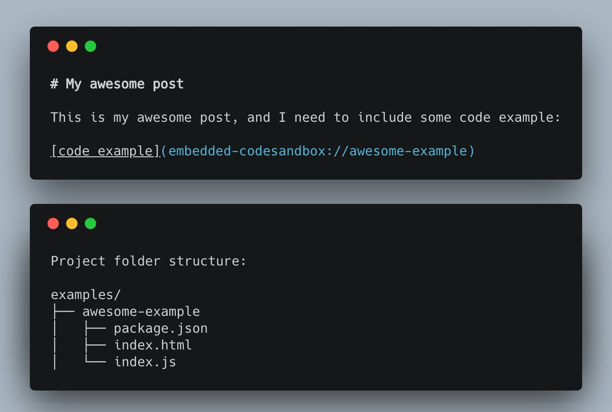

Don't build a website with last decade's tech. The future of the web is mobile, `JavaScript` and APIs—the

this project is build on `bash#?gatsby` based on  `react` I can highlight `css#?.some-class { background-color: red }` with CSS syntax.
`javascript#?import React from 'react';`

```javascript
import React from "react";

class Main extends React.Components {
  render() {
    return (
      <div>
        <p>Hello Gun</p>
      </div>
    );
  }
}
```

```html
<!DOCTYPE html>
<html lang="en">
<head>
  <meta charset="utf-8" />
  <title>I can haz embedded CSS and JS
  <style>
    @media print {
      p { color: red !important; }
    }
  </style>
</head>
<body>
  <h1>I can haz embedded CSS and JS
  <script>
  if (true) {
    console.log('foo');
  }
  </script>

</body>
</html>
```

```java
// highlight-next-line
import java.util.Scanner;

public class Life {

    @Override @Bind("One")
    public void show(boolean[][] grid){
        String s = "";
        for(boolean[] row : grid){
            for(boolean val : row)
                if(val)
                    s += "*";
                else
                    s += ".";
            s += "\n";
        }
        System.out.println(s);
    }

    public static boolean[][] gen(){
        boolean[][] grid = new boolean[10][10];
        for(int r = 0; r < 10; r++)
            for(int c = 0; c < 10; c++)
                if( Math.random() > 0.7 )
                    grid[r][c] = true;
        return grid;
    }

    public static void main(String[] args){
        boolean[][] world = gen();
        show(world);
        System.out.println();
        world = nextGen(world);
        show(world);
        Scanner s = new Scanner(System.in);
        while(s.nextLine().length() == 0){
            System.out.println();
            world = nextGen(world);
            show(world);

        }
    }

  // [...]
}
```

[React](https://reactjs.org)

1. Item 1
1. Item 2
1. Item 3
   1. Item 3a
   1. Item 3b




Lorem Ipsum is simply dummy text of the printing and typesetting industry.
Lorem Ipsum has been the industry's standard dummy text ever since the 1500s,
when an unknown printer took a galley of type and scrambled it to make a type s
pecimen book. It has survived not only five centuries, but also the leap into
electronic typesetting, remaining essentially unchanged. It was popularised in
the 1960s with the release of Letraset sheets containing Lorem Ipsum passages,
and more recently with desktop publishing software like Aldus PageMaker including
versions of Lorem Ipsum.

## Why do we use it?

It is a long established fact that a reader will be distracted by the readable
content of a page when looking at its layout. The point of using Lorem Ipsum
is that it has a more-or-less normal distribution of letters, as opposed to using
'Content here, content here', making it look like readable English.
Many desktop publishing packages and web page editors now use Lorem
Ipsum as their default model text and a search for 'lorem ipsum' will
uncover many web sites still in their infancy. Various versions have evolved
over the years, sometimes by accident, sometimes on purpose
(injected humor and the like).
